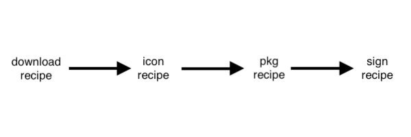

# franton-recipes

Recipes for Autopkg - https://github.com/autopkg

## Description

This repo is meant as a self contained repo where all the recipes and shared processors reside under one roof. I unfortunately have requirements that I must own the entire stack. I don't make the rules.

### Recipe Overview

The recipes here are comprised of the following and are executed in the following order:

download recipe - This merely downloads the .zip / .dmg / .pkg from the respective vendor.
icon recipe - Takes the download output, versions it and processes the app through [SAP's macOS icon generator](https://github.com/SAP/macOS-icon-generator) tool and places into a versioned folder.
pkg recipe - Takes either the download output or the decompressed output from the icon recipe and turns it into a deployable pkg. Some recipes have big custom scripting.
sign recipe - Optional. Use this if you have a requirement for signed final pkg generation.

It is ***highly recommended*** that you generate an autopkg override of the stage you require, just so you can customize the internal variable names. Most of these recipes will not run unless you do this!

(The idea for icon and sign recipes came from [Rich Trouton's blog](https://derflounder.wordpress.com/2021/07/30/signing-autopkg-built-packages-using-a-sign-recipe/) and I give attribution and thanks.)

### Shared Processors

Please see the README.md file in the SharedProcessors folder for author and copyright information. All shared processors are copyright of their respective authors.

IconGenerator.py is written partly by myself and requires [SAP macOS icon generator](https://github.com/SAP/macOS-icon-generator) to be installed on the system to run. Details on switches can be found in the code itself but the defaults are reasonably sensible.
